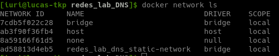
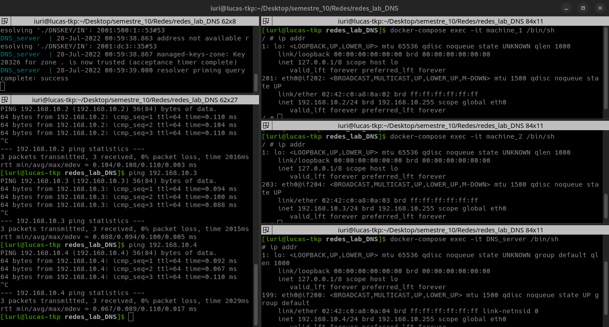
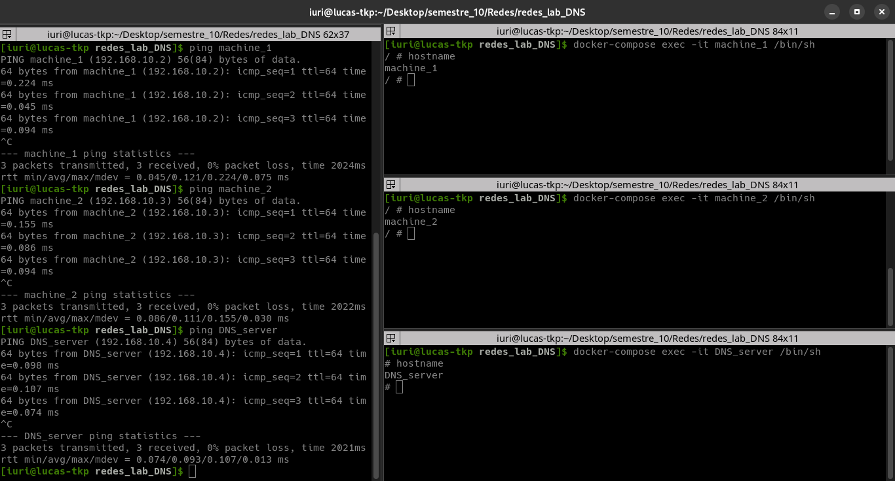
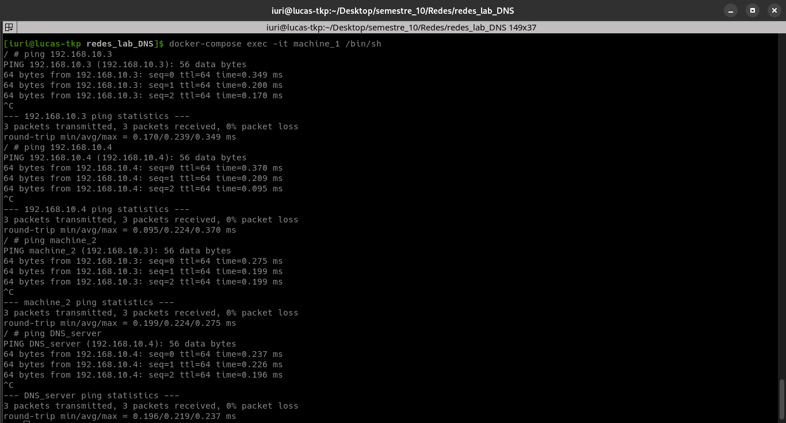
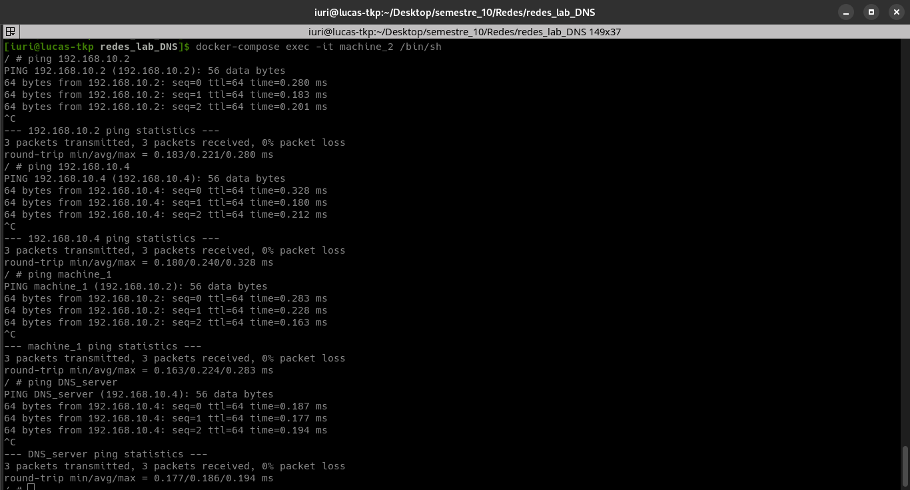
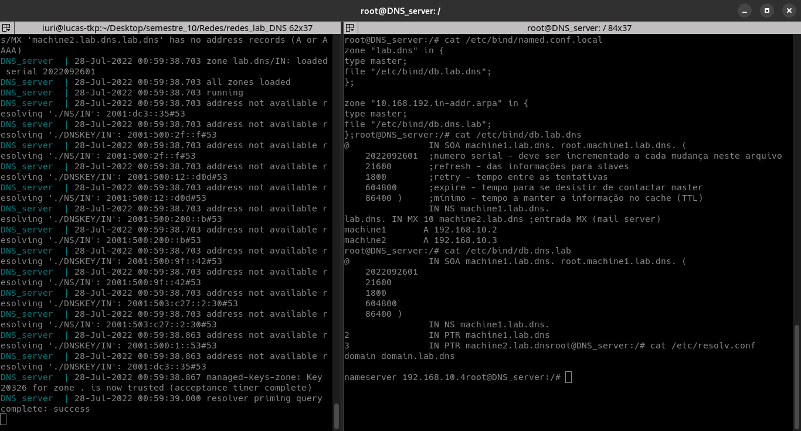

# Fundamentos de Redes de Computadores - Laboratório de DNS
Repositório para desenvolvimento do laboratório de DNS da matéria de Fundamentos de Redes de Computadores

A descrição da atividade realizada pode ser vista no documento [FRC_LAB_DNS.pdf](FRC_LAB_DNS.pdf)

**Aluno:** Iuri de Souza Severo Alves   **Matrícula:** 17/0145514

## Objetivos

**1 - Qual é o objetivo e como é o funcionamento do protocolo DNS.**
O _Domain Name System_ (DNS) é o que permite aos usuários se conectarem a sites usando nomes de domínio em vez de endereços de IP. O sistema DNS da internet funciona praticamente como uma agenda de telefone ao gerenciar o mapeamento entre nomes e números. Os servidores DNS convertem solicitações de nomes em endereços IP, controlando qual servidor um usuário final alcançará quando digitar um nome de domínio no navegador da web. É fundamental para o funcionamento da internet, para otimizar o desempenho e a segurança de um site.

**2 - O que é o resolver?***
Um resolvedor de DNS, também conhecido como _resolver_, é um servidor na Internet que converte nomes de domínio em endereços IP.

**3 - Como são feitas as consultas ao serviço DNS?**
Existem 4 servidores de DNS envolvidos no carregamento de uma página da internet:
* **Recursor de DNS** — o recursor pode ser imaginado como um bibliotecário solicitado a procurar um livro específico em algum lugar de uma biblioteca. O recursor de DNS é um servidor projetado para receber consultas de máquinas clientes por meio de aplicações como navegadores web. De modo geral, o recursor é responsável por fazer solicitações adicionais para atender à consulta de DNS do cliente.
* **Servidor raiz** — o servidor raiz é a primeira etapa da tradução (resolução) de host names legíveis por humanos em endereços IP. Pode ser imaginado como um índice em uma biblioteca que aponta para diferentes estantes de livros — geralmente serve como referência para outros locais mais específicos.
* **Nameserver TLD** - Pense no servidor de domínio de nível superior (TLD) como uma estante de livros específica em uma biblioteca. Esse nameserver é o próximo passo na busca de um endereço de IP específico e hospeda a última parte de um hostname (em exemplo.com, o servidor de TLD é "com").
* **Servidor de DNS autoritativo** — esse servidor de DNS final pode ser imaginado como um dicionário em uma estante de livros, no qual um nome específico pode ser traduzido em sua definição. O nameserver autoritativo é a última parada na consulta de um servidor de DNS. Se tiver acesso ao registro solicitado, o nameserver autoritativo retornará o endereço IP do hostname solicitado de volta ao recursor de DNS (o bibliotecário) que fez a solicitação inicial.

**4 - Software BIND (o mais usado atualmente para implementar um servidor DNS).**
O Berkeley Internet Name Domain (BIND) é o servidor DNS mais popular em uso atualmente. Foi desenvolvido na década de 1980 na Universidade de Berkley e está atualmente na versão 9. BIND é um sistema de código aberto gratuito para download e uso, oferecido sob a Licença Pública Mozilla.

O BIND pode ser usado para executar um servidor DNS de cache ou um servidor de nomes autoritativo e fornece recursos como balanceamento de carga, notificação, atualização dinâmica, DNS dividido, DNSSEC, IPv6 e muito mais.

## Experimento

Para realização do experimento foi utilizada a ferramenta _Docker_ com auxílio do _Docker-Compose_. Foram criados dois _Containers_ para representar máquinas simples, **machine_1** e **machine_2**, e um _Container_ para o server DNS com Bind, **DNS_server**. A conexão entre os _containers_ e a máquina local foi realizada a partir da criação de uma _bridge_, nomeada **static-network**. O arquivo [_docker-compose.yml_](docker-compose.yml) foi utilizado para orquestrar os containers e configurar a relação deles com a _bridge_ criada.



A partir disso foi possível testar a conexão entre os containers com o comando _ping_.



Após a configuração do arquivo _/etc/hosts_, segui a configuração apresentada no arquivo [hosts](hosts) foi possível realizar o ping a partir do _hostname_.



Também era possível realizar _ping_ entre os containers.





Por fim, a configuração do Bind seguiu os arquivos [_named.conf.local_](named.conf.local), [_resolv.conf_](resolv.conf) e os arquivos encontrados na pasta _records_, [_db.dns.lab_](records/db.dns.lab) e [_db.lab.dns_](records/db.lab.dns). Esses arquivos são passados para o _bind_ a partir da configuração de volumes do _docker-compose_.



O log completo da execução do _bind_ pode ser visto abaixo:

```
DNS_server  | Starting named...
DNS_server  | exec /usr/sbin/named -u "bind" -g ""
DNS_server  | 28-Jul-2022 01:33:55.480 starting BIND 9.18.1-1ubuntu1-Ubuntu (Stable Release) <id:>
DNS_server  | 28-Jul-2022 01:33:55.480 running on Linux x86_64 5.17.15-1-MANJARO #1 SMP PREEMPT Wed Jun 15 07:09:31 UTC 2022
DNS_server  | 28-Jul-2022 01:33:55.480 built with  '--build=x86_64-linux-gnu' '--prefix=/usr' '--includedir=${prefix}/include' '--mandir=${prefix}/share/man' '--infodir=${prefix}/share/info' '--sysconfdir=/etc' '--localstatedir=/var' '--disable-option-checking' '--disable-silent-rules' '--libdir=${prefix}/lib/x86_64-linux-gnu' '--runstatedir=/run' '--disable-maintainer-mode' '--disable-dependency-tracking' '--libdir=/usr/lib/x86_64-linux-gnu' '--sysconfdir=/etc/bind' '--with-python=python3' '--localstatedir=/' '--enable-threads' '--enable-largefile' '--with-libtool' '--enable-shared' '--disable-static' '--with-gost=no' '--with-openssl=/usr' '--with-gssapi=yes' '--with-libidn2' '--with-json-c' '--with-lmdb=/usr' '--with-gnu-ld' '--with-maxminddb' '--with-atf=no' '--enable-ipv6' '--enable-rrl' '--enable-filter-aaaa' '--disable-native-pkcs11' 'build_alias=x86_64-linux-gnu' 'CFLAGS=-g -O2 -ffile-prefix-map=/build/bind9-2SW0bQ/bind9-9.18.1=. -flto=auto -ffat-lto-objects -flto=auto -ffat-lto-objects -fstack-protector-strong -Wformat -Werror=format-security -fno-strict-aliasing -fno-delete-null-pointer-checks -DNO_VERSION_DATE -DDIG_SIGCHASE' 'LDFLAGS=-Wl,-Bsymbolic-functions -flto=auto -ffat-lto-objects -flto=auto -Wl,-z,relro -Wl,-z,now' 'CPPFLAGS=-Wdate-time -D_FORTIFY_SOURCE=2'
DNS_server  | 28-Jul-2022 01:33:55.480 running as: named -u bind -g
DNS_server  | 28-Jul-2022 01:33:55.480 compiled by GCC 11.2.0
DNS_server  | 28-Jul-2022 01:33:55.480 compiled with OpenSSL version: OpenSSL 3.0.2 15 Mar 2022
DNS_server  | 28-Jul-2022 01:33:55.480 linked to OpenSSL version: OpenSSL 3.0.2 15 Mar 2022
DNS_server  | 28-Jul-2022 01:33:55.480 compiled with libxml2 version: 2.9.13
DNS_server  | 28-Jul-2022 01:33:55.480 linked to libxml2 version: 20913
DNS_server  | 28-Jul-2022 01:33:55.480 compiled with json-c version: 0.15
DNS_server  | 28-Jul-2022 01:33:55.480 linked to json-c version: 0.15
DNS_server  | 28-Jul-2022 01:33:55.480 compiled with zlib version: 1.2.11
DNS_server  | 28-Jul-2022 01:33:55.480 linked to zlib version: 1.2.11
DNS_server  | 28-Jul-2022 01:33:55.480 ----------------------------------------------------
DNS_server  | 28-Jul-2022 01:33:55.480 BIND 9 is maintained by Internet Systems Consortium,
DNS_server  | 28-Jul-2022 01:33:55.480 Inc. (ISC), a non-profit 501(c)(3) public-benefit 
DNS_server  | 28-Jul-2022 01:33:55.480 corporation.  Support and training for BIND 9 are 
DNS_server  | 28-Jul-2022 01:33:55.480 available at https://www.isc.org/support
DNS_server  | 28-Jul-2022 01:33:55.480 ----------------------------------------------------
DNS_server  | 28-Jul-2022 01:33:55.480 found 4 CPUs, using 4 worker threads
DNS_server  | 28-Jul-2022 01:33:55.480 using 4 UDP listeners per interface
DNS_server  | 28-Jul-2022 01:33:55.483 config.c: option 'trust-anchor-telemetry' is experimental and subject to change in the future
DNS_server  | 28-Jul-2022 01:33:55.483 loading configuration from '/etc/bind/named.conf'
DNS_server  | 28-Jul-2022 01:33:55.483 reading built-in trust anchors from file '/etc/bind/bind.keys'
DNS_server  | 28-Jul-2022 01:33:55.483 looking for GeoIP2 databases in '/usr/share/GeoIP'
DNS_server  | 28-Jul-2022 01:33:55.483 using default UDP/IPv4 port range: [32768, 60999]
DNS_server  | 28-Jul-2022 01:33:55.483 using default UDP/IPv6 port range: [32768, 60999]
DNS_server  | 28-Jul-2022 01:33:55.483 listening on IPv4 interface lo, 127.0.0.1#53
DNS_server  | 28-Jul-2022 01:33:55.487 listening on IPv4 interface eth0, 192.168.10.4#53
DNS_server  | 28-Jul-2022 01:33:55.487 generating session key for dynamic DNS
DNS_server  | 28-Jul-2022 01:33:55.487 sizing zone task pool based on 7 zones
DNS_server  | 28-Jul-2022 01:33:55.487 none:97: 'max-cache-size 90%' - setting to 14172MB (out of 15747MB)
DNS_server  | 28-Jul-2022 01:33:55.487 obtaining root key for view _default from '/etc/bind/bind.keys'
DNS_server  | 28-Jul-2022 01:33:55.487 set up managed keys zone for view _default, file 'managed-keys.bind'
DNS_server  | 28-Jul-2022 01:33:55.487 automatic empty zone: 10.IN-ADDR.ARPA
DNS_server  | 28-Jul-2022 01:33:55.487 automatic empty zone: 16.172.IN-ADDR.ARPA
DNS_server  | 28-Jul-2022 01:33:55.487 automatic empty zone: 17.172.IN-ADDR.ARPA
DNS_server  | 28-Jul-2022 01:33:55.487 automatic empty zone: 18.172.IN-ADDR.ARPA
DNS_server  | 28-Jul-2022 01:33:55.487 automatic empty zone: 19.172.IN-ADDR.ARPA
DNS_server  | 28-Jul-2022 01:33:55.487 automatic empty zone: 20.172.IN-ADDR.ARPA
DNS_server  | 28-Jul-2022 01:33:55.487 automatic empty zone: 21.172.IN-ADDR.ARPA
DNS_server  | 28-Jul-2022 01:33:55.487 automatic empty zone: 22.172.IN-ADDR.ARPA
DNS_server  | 28-Jul-2022 01:33:55.487 automatic empty zone: 23.172.IN-ADDR.ARPA
DNS_server  | 28-Jul-2022 01:33:55.487 automatic empty zone: 24.172.IN-ADDR.ARPA
DNS_server  | 28-Jul-2022 01:33:55.487 automatic empty zone: 25.172.IN-ADDR.ARPA
DNS_server  | 28-Jul-2022 01:33:55.487 automatic empty zone: 26.172.IN-ADDR.ARPA
DNS_server  | 28-Jul-2022 01:33:55.487 automatic empty zone: 27.172.IN-ADDR.ARPA
DNS_server  | 28-Jul-2022 01:33:55.487 automatic empty zone: 28.172.IN-ADDR.ARPA
DNS_server  | 28-Jul-2022 01:33:55.487 automatic empty zone: 29.172.IN-ADDR.ARPA
DNS_server  | 28-Jul-2022 01:33:55.487 automatic empty zone: 30.172.IN-ADDR.ARPA
DNS_server  | 28-Jul-2022 01:33:55.487 automatic empty zone: 31.172.IN-ADDR.ARPA
DNS_server  | 28-Jul-2022 01:33:55.487 automatic empty zone: 168.192.IN-ADDR.ARPA
DNS_server  | 28-Jul-2022 01:33:55.487 automatic empty zone: 64.100.IN-ADDR.ARPA
DNS_server  | 28-Jul-2022 01:33:55.487 automatic empty zone: 65.100.IN-ADDR.ARPA
DNS_server  | 28-Jul-2022 01:33:55.487 automatic empty zone: 66.100.IN-ADDR.ARPA
DNS_server  | 28-Jul-2022 01:33:55.487 automatic empty zone: 67.100.IN-ADDR.ARPA
DNS_server  | 28-Jul-2022 01:33:55.487 automatic empty zone: 68.100.IN-ADDR.ARPA
DNS_server  | 28-Jul-2022 01:33:55.487 automatic empty zone: 69.100.IN-ADDR.ARPA
DNS_server  | 28-Jul-2022 01:33:55.487 automatic empty zone: 70.100.IN-ADDR.ARPA
DNS_server  | 28-Jul-2022 01:33:55.487 automatic empty zone: 71.100.IN-ADDR.ARPA
DNS_server  | 28-Jul-2022 01:33:55.487 automatic empty zone: 72.100.IN-ADDR.ARPA
DNS_server  | 28-Jul-2022 01:33:55.487 automatic empty zone: 73.100.IN-ADDR.ARPA
DNS_server  | 28-Jul-2022 01:33:55.487 automatic empty zone: 74.100.IN-ADDR.ARPA
DNS_server  | 28-Jul-2022 01:33:55.487 automatic empty zone: 75.100.IN-ADDR.ARPA
DNS_server  | 28-Jul-2022 01:33:55.487 automatic empty zone: 76.100.IN-ADDR.ARPA
DNS_server  | 28-Jul-2022 01:33:55.487 automatic empty zone: 77.100.IN-ADDR.ARPA
DNS_server  | 28-Jul-2022 01:33:55.487 automatic empty zone: 78.100.IN-ADDR.ARPA
DNS_server  | 28-Jul-2022 01:33:55.487 automatic empty zone: 79.100.IN-ADDR.ARPA
DNS_server  | 28-Jul-2022 01:33:55.487 automatic empty zone: 80.100.IN-ADDR.ARPA
DNS_server  | 28-Jul-2022 01:33:55.487 automatic empty zone: 81.100.IN-ADDR.ARPA
DNS_server  | 28-Jul-2022 01:33:55.487 automatic empty zone: 82.100.IN-ADDR.ARPA
DNS_server  | 28-Jul-2022 01:33:55.487 automatic empty zone: 83.100.IN-ADDR.ARPA
DNS_server  | 28-Jul-2022 01:33:55.487 automatic empty zone: 84.100.IN-ADDR.ARPA
DNS_server  | 28-Jul-2022 01:33:55.487 automatic empty zone: 85.100.IN-ADDR.ARPA
DNS_server  | 28-Jul-2022 01:33:55.487 automatic empty zone: 86.100.IN-ADDR.ARPA
DNS_server  | 28-Jul-2022 01:33:55.487 automatic empty zone: 87.100.IN-ADDR.ARPA
DNS_server  | 28-Jul-2022 01:33:55.487 automatic empty zone: 88.100.IN-ADDR.ARPA
DNS_server  | 28-Jul-2022 01:33:55.487 automatic empty zone: 89.100.IN-ADDR.ARPA
DNS_server  | 28-Jul-2022 01:33:55.487 automatic empty zone: 90.100.IN-ADDR.ARPA
DNS_server  | 28-Jul-2022 01:33:55.487 automatic empty zone: 91.100.IN-ADDR.ARPA
DNS_server  | 28-Jul-2022 01:33:55.487 automatic empty zone: 92.100.IN-ADDR.ARPA
DNS_server  | 28-Jul-2022 01:33:55.487 automatic empty zone: 93.100.IN-ADDR.ARPA
DNS_server  | 28-Jul-2022 01:33:55.487 automatic empty zone: 94.100.IN-ADDR.ARPA
DNS_server  | 28-Jul-2022 01:33:55.487 automatic empty zone: 95.100.IN-ADDR.ARPA
DNS_server  | 28-Jul-2022 01:33:55.490 automatic empty zone: 96.100.IN-ADDR.ARPA
DNS_server  | 28-Jul-2022 01:33:55.490 automatic empty zone: 97.100.IN-ADDR.ARPA
DNS_server  | 28-Jul-2022 01:33:55.490 automatic empty zone: 98.100.IN-ADDR.ARPA
DNS_server  | 28-Jul-2022 01:33:55.490 automatic empty zone: 99.100.IN-ADDR.ARPA
DNS_server  | 28-Jul-2022 01:33:55.490 automatic empty zone: 100.100.IN-ADDR.ARPA
DNS_server  | 28-Jul-2022 01:33:55.490 automatic empty zone: 101.100.IN-ADDR.ARPA
DNS_server  | 28-Jul-2022 01:33:55.490 automatic empty zone: 102.100.IN-ADDR.ARPA
DNS_server  | 28-Jul-2022 01:33:55.490 automatic empty zone: 103.100.IN-ADDR.ARPA
DNS_server  | 28-Jul-2022 01:33:55.490 automatic empty zone: 104.100.IN-ADDR.ARPA
DNS_server  | 28-Jul-2022 01:33:55.490 automatic empty zone: 105.100.IN-ADDR.ARPA
DNS_server  | 28-Jul-2022 01:33:55.490 automatic empty zone: 106.100.IN-ADDR.ARPA
DNS_server  | 28-Jul-2022 01:33:55.490 automatic empty zone: 107.100.IN-ADDR.ARPA
DNS_server  | 28-Jul-2022 01:33:55.490 automatic empty zone: 108.100.IN-ADDR.ARPA
DNS_server  | 28-Jul-2022 01:33:55.490 automatic empty zone: 109.100.IN-ADDR.ARPA
DNS_server  | 28-Jul-2022 01:33:55.490 automatic empty zone: 110.100.IN-ADDR.ARPA
DNS_server  | 28-Jul-2022 01:33:55.490 automatic empty zone: 111.100.IN-ADDR.ARPA
DNS_server  | 28-Jul-2022 01:33:55.490 automatic empty zone: 112.100.IN-ADDR.ARPA
DNS_server  | 28-Jul-2022 01:33:55.490 automatic empty zone: 113.100.IN-ADDR.ARPA
DNS_server  | 28-Jul-2022 01:33:55.490 automatic empty zone: 114.100.IN-ADDR.ARPA
DNS_server  | 28-Jul-2022 01:33:55.490 automatic empty zone: 115.100.IN-ADDR.ARPA
DNS_server  | 28-Jul-2022 01:33:55.490 automatic empty zone: 116.100.IN-ADDR.ARPA
DNS_server  | 28-Jul-2022 01:33:55.490 automatic empty zone: 117.100.IN-ADDR.ARPA
DNS_server  | 28-Jul-2022 01:33:55.490 automatic empty zone: 118.100.IN-ADDR.ARPA
DNS_server  | 28-Jul-2022 01:33:55.490 automatic empty zone: 119.100.IN-ADDR.ARPA
DNS_server  | 28-Jul-2022 01:33:55.490 automatic empty zone: 120.100.IN-ADDR.ARPA
DNS_server  | 28-Jul-2022 01:33:55.490 automatic empty zone: 121.100.IN-ADDR.ARPA
DNS_server  | 28-Jul-2022 01:33:55.490 automatic empty zone: 122.100.IN-ADDR.ARPA
DNS_server  | 28-Jul-2022 01:33:55.490 automatic empty zone: 123.100.IN-ADDR.ARPA
DNS_server  | 28-Jul-2022 01:33:55.490 automatic empty zone: 124.100.IN-ADDR.ARPA
DNS_server  | 28-Jul-2022 01:33:55.490 automatic empty zone: 125.100.IN-ADDR.ARPA
DNS_server  | 28-Jul-2022 01:33:55.490 automatic empty zone: 126.100.IN-ADDR.ARPA
DNS_server  | 28-Jul-2022 01:33:55.490 automatic empty zone: 127.100.IN-ADDR.ARPA
DNS_server  | 28-Jul-2022 01:33:55.490 automatic empty zone: 254.169.IN-ADDR.ARPA
DNS_server  | 28-Jul-2022 01:33:55.490 automatic empty zone: 2.0.192.IN-ADDR.ARPA
DNS_server  | 28-Jul-2022 01:33:55.490 automatic empty zone: 100.51.198.IN-ADDR.ARPA
DNS_server  | 28-Jul-2022 01:33:55.490 automatic empty zone: 113.0.203.IN-ADDR.ARPA
DNS_server  | 28-Jul-2022 01:33:55.490 automatic empty zone: 255.255.255.255.IN-ADDR.ARPA
DNS_server  | 28-Jul-2022 01:33:55.490 automatic empty zone: 0.0.0.0.0.0.0.0.0.0.0.0.0.0.0.0.0.0.0.0.0.0.0.0.0.0.0.0.0.0.0.0.IP6.ARPA
DNS_server  | 28-Jul-2022 01:33:55.490 automatic empty zone: 1.0.0.0.0.0.0.0.0.0.0.0.0.0.0.0.0.0.0.0.0.0.0.0.0.0.0.0.0.0.0.0.IP6.ARPA
DNS_server  | 28-Jul-2022 01:33:55.490 automatic empty zone: D.F.IP6.ARPA
DNS_server  | 28-Jul-2022 01:33:55.490 automatic empty zone: 8.E.F.IP6.ARPA
DNS_server  | 28-Jul-2022 01:33:55.490 automatic empty zone: 9.E.F.IP6.ARPA
DNS_server  | 28-Jul-2022 01:33:55.490 automatic empty zone: A.E.F.IP6.ARPA
DNS_server  | 28-Jul-2022 01:33:55.490 automatic empty zone: B.E.F.IP6.ARPA
DNS_server  | 28-Jul-2022 01:33:55.490 automatic empty zone: 8.B.D.0.1.0.0.2.IP6.ARPA
DNS_server  | 28-Jul-2022 01:33:55.490 automatic empty zone: EMPTY.AS112.ARPA
DNS_server  | 28-Jul-2022 01:33:55.490 automatic empty zone: HOME.ARPA
DNS_server  | 28-Jul-2022 01:33:55.490 configuring command channel from '/etc/bind/rndc.key'
DNS_server  | 28-Jul-2022 01:33:55.490 command channel listening on 127.0.0.1#953
DNS_server  | 28-Jul-2022 01:33:55.490 configuring command channel from '/etc/bind/rndc.key'
DNS_server  | 28-Jul-2022 01:33:55.490 command channel listening on ::1#953
DNS_server  | 28-Jul-2022 01:33:55.490 not using config file logging statement for logging due to -g option
DNS_server  | 28-Jul-2022 01:33:55.493 managed-keys-zone: loaded serial 13
DNS_server  | 28-Jul-2022 01:33:55.493 zone 0.in-addr.arpa/IN: loaded serial 1
DNS_server  | 28-Jul-2022 01:33:55.493 address not available resolving './DNSKEY/IN': 2001:dc3::35#53
DNS_server  | 28-Jul-2022 01:33:55.493 address not available resolving './NS/IN': 2001:dc3::35#53
DNS_server  | 28-Jul-2022 01:33:55.493 address not available resolving './DNSKEY/IN': 2001:500:2f::f#53
DNS_server  | 28-Jul-2022 01:33:55.493 zone 127.in-addr.arpa/IN: loaded serial 1
DNS_server  | 28-Jul-2022 01:33:55.493 address not available resolving './NS/IN': 2001:500:2f::f#53
DNS_server  | 28-Jul-2022 01:33:55.493 address not available resolving './DNSKEY/IN': 2001:503:ba3e::2:30#53
DNS_server  | 28-Jul-2022 01:33:55.493 address not available resolving './NS/IN': 2001:503:ba3e::2:30#53
DNS_server  | 28-Jul-2022 01:33:55.497 address not available resolving './DNSKEY/IN': 2001:7fe::53#53
DNS_server  | 28-Jul-2022 01:33:55.497 address not available resolving './NS/IN': 2001:7fe::53#53
DNS_server  | 28-Jul-2022 01:33:55.497 /etc/bind/db.dns.lab:1: no TTL specified; using SOA MINTTL instead
DNS_server  | 28-Jul-2022 01:33:55.497 address not available resolving './DNSKEY/IN': 2001:500:12::d0d#53
DNS_server  | 28-Jul-2022 01:33:55.497 /etc/bind/db.dns.lab:9: file does not end with newline
DNS_server  | 28-Jul-2022 01:33:55.497 zone 10.168.192.in-addr.arpa/IN: loaded serial 2022092601
DNS_server  | 28-Jul-2022 01:33:55.497 address not available resolving './NS/IN': 2001:500:12::d0d#53
DNS_server  | 28-Jul-2022 01:33:55.497 address not available resolving './DNSKEY/IN': 2001:503:c27::2:30#53
DNS_server  | 28-Jul-2022 01:33:55.497 zone 255.in-addr.arpa/IN: loaded serial 1
DNS_server  | 28-Jul-2022 01:33:55.497 address not available resolving './NS/IN': 2001:503:c27::2:30#53
DNS_server  | 28-Jul-2022 01:33:55.497 /etc/bind/db.lab.dns:1: no TTL specified; using SOA MINTTL instead
DNS_server  | 28-Jul-2022 01:33:55.497 address not available resolving './DNSKEY/IN': 2001:500:a8::e#53
DNS_server  | 28-Jul-2022 01:33:55.497 zone lab.dns/IN: lab.dns/MX 'machine2.lab.dns.lab.dns' has no address records (A or AAAA)
DNS_server  | 28-Jul-2022 01:33:55.497 address not available resolving './NS/IN': 2001:500:a8::e#53
DNS_server  | 28-Jul-2022 01:33:55.497 zone lab.dns/IN: loaded serial 2022092601
DNS_server  | 28-Jul-2022 01:33:55.497 address not available resolving './DNSKEY/IN': 2001:500:1::53#53
DNS_server  | 28-Jul-2022 01:33:55.497 zone localhost/IN: loaded serial 2
DNS_server  | 28-Jul-2022 01:33:55.497 all zones loaded
DNS_server  | 28-Jul-2022 01:33:55.497 running
DNS_server  | 28-Jul-2022 01:33:55.497 address not available resolving './NS/IN': 2001:500:1::53#53
DNS_server  | 28-Jul-2022 01:33:55.497 address not available resolving './DNSKEY/IN': 2001:7fd::1#53
DNS_server  | 28-Jul-2022 01:33:55.497 address not available resolving './NS/IN': 2001:7fd::1#53
DNS_server  | 28-Jul-2022 01:33:55.497 address not available resolving './DNSKEY/IN': 2001:500:2::c#53
DNS_server  | 28-Jul-2022 01:33:55.497 address not available resolving './NS/IN': 2001:500:2::c#53
DNS_server  | 28-Jul-2022 01:33:55.497 address not available resolving './DNSKEY/IN': 2001:500:9f::42#53
DNS_server  | 28-Jul-2022 01:33:55.497 address not available resolving './NS/IN': 2001:500:9f::42#53
DNS_server  | 28-Jul-2022 01:33:55.497 address not available resolving './DNSKEY/IN': 2001:500:2d::d#53
DNS_server  | 28-Jul-2022 01:33:55.497 address not available resolving './NS/IN': 2001:500:2d::d#53
DNS_server  | 28-Jul-2022 01:33:55.497 address not available resolving './DNSKEY/IN': 2001:500:200::b#53
DNS_server  | 28-Jul-2022 01:33:55.497 address not available resolving './NS/IN': 2001:500:200::b#53
DNS_server  | 28-Jul-2022 01:33:55.703 managed-keys-zone: Key 20326 for zone . is now trusted (acceptance timer complete)
DNS_server  | 28-Jul-2022 01:33:55.707 resolver priming query complete: success
```

## Referências

* https://www.cloudflare.com/pt-br/learning/dns/what-is-dns/#:~:text=Um%20usu%C3%A1rio%20digita%20%22exemplo.com,)%20(como%20.com%20ou%20.
* https://aws.amazon.com/pt/route53/what-is-dns/#:~:text=O%20sistema%20DNS%20da%20internet,dom%C3%ADnio%20no%20navegador%20da%20web.
* https://www.computerhope.com/jargon/d/dns-resolver.htm
* https://kb.isc.org/docs/aa-01031
* https://ns1.com/resources/bind-dns-pros-cons-and-alternatives#:~:text=Berkeley%20Internet%20Name%20Domain%20(BIND,under%20the%20Mozilla%20Public%20License.